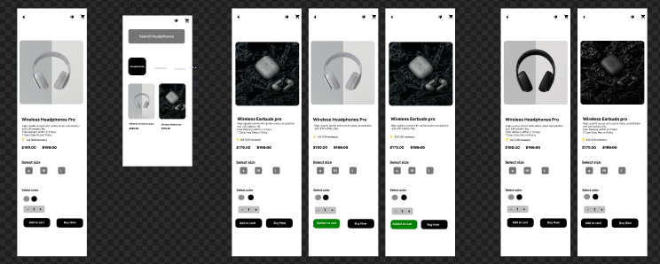

# MotionCut Project 2 - E-Commerce Product Page UI

A modern and conversion-focused mobile product detail page UI for an e-commerce application[cite: 1].

## 📱 Screen Preview

## 🎯 Features Designed
- **Header:** Back button, wishlist icon, and cart icon[cite: 1].
- **Product Showcase:** Large image section with carousel indicators[cite: 1].
- **Product Details:** Price details ($179.00), ratings, and description[cite: 1].
- **Selectors:** Size (S, M, L) and color selection chips along with a quantity selector[cite: 1].
- **Sticky Bottom Area:** Clean "Add to Cart" and "Buy Now" buttons[cite: 1].

## 🔗 Live Figma Link
[View Project in Figma](https://www.figma.com/design/YUuAI8UZ2jGjrupcUdjUt2/Untitled?node-id=0-1&t=tGQC9HQ1NtnbQL5j-1)
